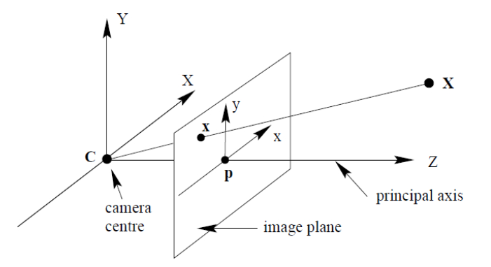
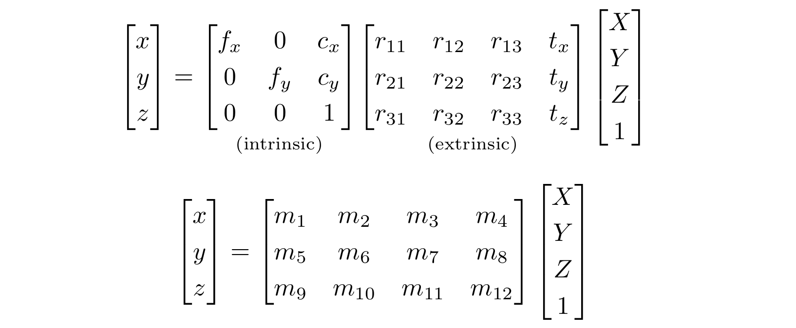
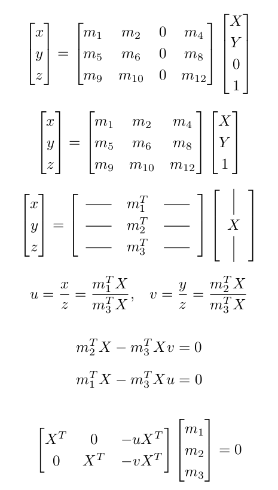
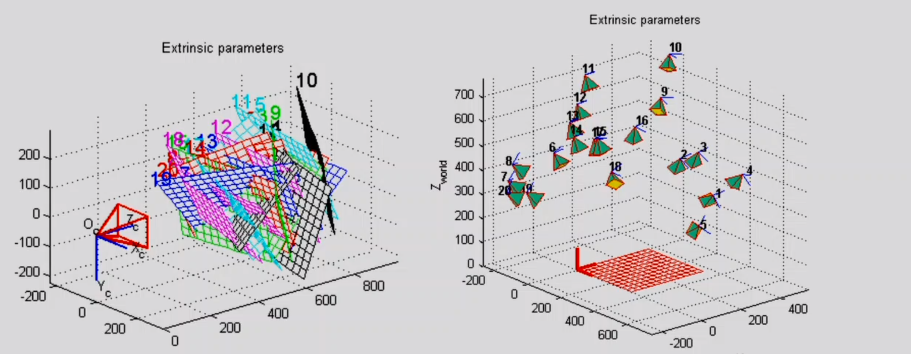
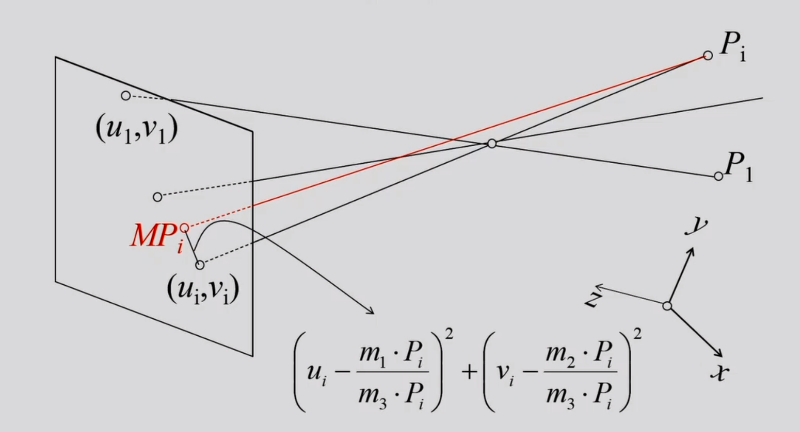
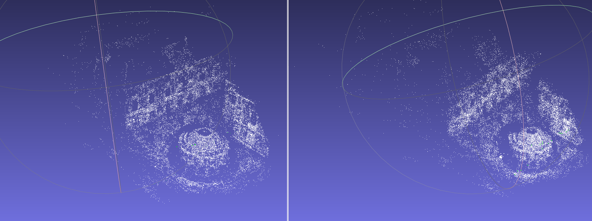

# Camera Calibration and Bundle Adjustment

Camera calibration involves determining the internal parameters of a camera that explain how a point in a 3D world is translated onto a 2D image plane.This subject is significantly popular but remains widely misunderstood. It delves into a complex web of related topics, including linear transformations, Singular value decomposition(SVD), Bundle Adjustment, Non-linear least-sqauares etc. We will discuss them all and also see the code. We will also make use of powerfull C++ libraries like Eigen and Ceres to solve our Linear and nonlinear problems. We will see... 
- What exactly is camera calibration? 
- The linear solution using linear algebra
- The Non-linear soltion using Bundle Adjustment 

## Linear Solution
The pinhole camera model describes the mathematical relationship between the coordinates of a point in three-dimensional space and its projection onto the image plane of an ideal pinhole camera, where the camera aperture is described as a point and no lenses are used to focus light.
<p align="center">
   
</p>

Assuming the world and image points are represented in homogeneous coordinates, then the projection of 3D point X can simply expressed as a linear mapping between their homogeneous coordinates in terms of matrix multiplication by u,

<p align="center">
   
</p>


To solve for M , we need pairs of image points ⃗u and 3D points X. We may be calibrating a camera to capture images of a planar surface (e.g., a checker-board pattern).
Since we are deciding the coordinate frame. We can put the checkerboard plane as Z = 0
<p align="center">
   
</p>
We can solve this linear system using Least Squared method in this form A⃗x = 0

<p align="center">
   
</p>

## Non-linear solution
There are some disadvantages of linear solutions:
- Doesn’t model radial distortion
- Hard to impose constrains(e.g. known f )
For these reasons non-linear methods are preferred. For non linear solution, we can define Loss function E between projected 3D points and image positions. This loss funiton is called **re-projection error**
- Then we can minimise E using non-linear optimisation techniques
- This repo uses C++ library Ceres to optimize the **Reprojection error**

<p align="center">
   
</p>

Below is the code snippet which is defining the obejective funtion in C++.

  


```cpp
template<typename T>
    bool operator()(const T *const camera, const T *const point, T *residuals) const {
        T predictions[2];
        CamProjectionWithDistortion(camera, point, predictions);
        residuals[0] = predictions[0] - T(observed_x);
        residuals[1] = predictions[1] - T(observed_y);

        return true;
    }

```
To perform bundle adjustment I use BAL dataset. BAL dataset uses images from Flickr.com to construct the point cloud of bulding in Rome, Venice, Denmark etc.
Below is the output of my performance of bundle adjustment on that dataset.

<p align="center">
   
</p>


